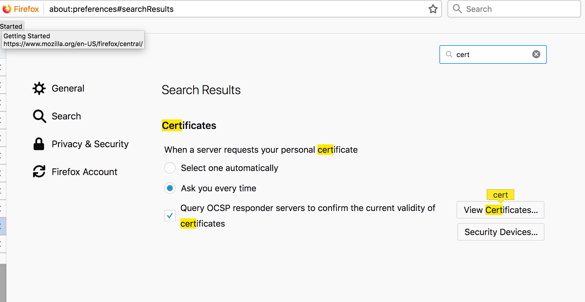
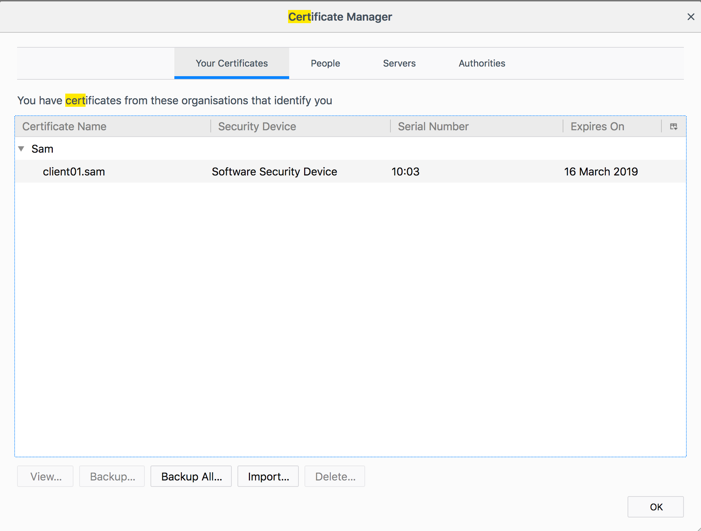

# certificate-authority

Command summary

* **create new keys**: genrsa -out output.key -aes256 4096 - create a
  new 4096 bit aes256 private key
* **create ca certificate**: openssl req -new -x509 -sha256 -days 7300 -key input.key -out output.cert -config openssl.cnf - creates a new root x509 certificate immediately - there is no CSRs because it is self signed
* **create a normal certificate requests**: openssl req -new -sha256 -config openssl_san.cnf -key input.key -out output.csr
* **sign server certificates**: openssl ca -config openssl.cnf -extensions server_cert -md sha256 -notext -days 300 -in csr/server.csr.pem -out certs/server.cert.pem
* **sign intermediate certificates**: openssl ca -config openssl.cnf -extensions v3_intermediate_ca -days 3200 -notext -md sha256 -in intermediate/csr/intermediate.csr.pem -out intermediate/certs/intermediate.cert.pem


# create the ca

```
openssl genrsa -aes256 -out private/ca.key.pem 4096
```

Note: When you pass x509 to req, it will generate an actual certificate,
not a certificate request.
```
openssl req -new -x509 -extensions v3_ca -config openssl.cnf -sha256 -days 7300 -key private/ca.key.pem -out certs/ca.cert.pem
```

Inspect the ca certificate
```
openssl x509 -noout -text -in certs/ca.cert.pem | less
```

```
diff -q <(openssl rsa -pubout -in private/ca.key.pem -passin pass:XXX) <(openssl x509 -noout -pubkey -in certs/ca.cert.pem)
echo $?
```

# create the intermediate ca

The following commands run from the intermediate folder.

Create the intermediate key

```
openssl genrsa -aes256 -out private/intermediate.key.pem 4096
```

Create the intermediate Certificate Signing Request

```
openssl req -new -sha256 -config openssl.cnf -key private/intermediate.key.pem -out csr/intermediate.csr.pem
```

# Sign the intermediate CA

Go back to root

```
openssl ca -config openssl.cnf -extensions v3_intermediate_ca -days 3200 -notext -md sha256 -in intermediate/csr/intermediate.csr.pem -out intermediate/certs/intermediate.cert.pem
```

Inspect the intermediate certificate

```
openssl x509 -in intermediate/certs/intermediate.cert.pem  -noout -text | less
```

Verify it is signed by the ca:

```
openssl verify -CAfile certs/ca.cert.pem intermediate/certs/intermediate.cert.pem
```

# issuing your server certificates with subjectAltName

Go back to intermediate CA

```
cd intermediate
```

Create your server key

```
openssl genrsa -aes256 -out private/server.key.pem 4096
```

Create your CSR for your server. Note the lack of -x509 this time, as
this is a request, not a complete certificate. (If you miss out the -key
option, openssl will create a new key for you, which may be confusing
because we want to use the above created key!)

```
openssl req -new -sha256 -config openssl_san.cnf -key private/server.key.pem -out certs/server.cert.pem
```

Verify your CSR has the subjectAltName

```
openssl req -in csr/server.csr.pem -noout -text | less
```

Sign the CSR with the intermediate:

```
openssl ca -config openssl.cnf -extensions server_cert -md sha256 -notext -days 300 -in csr/server.csr.pem -out certs/server.cert.pem
```

Check the certificate corresponds to your key:

```
diff -q <(openssl rsa -pubout -in private/server.key.pem -passin pass:XXX) <(openssl x509 -in certs/server.cert.pem -noout -pubkey)
echo $?
```

Now inspect the certificate - check the SAN:

```
openssl x509 -in certs/server.cert.pem  -text -noout | less
```

Verify that the chain is correct where arrows are signed by: CA <- Intermediate <- Server.

```
openssl verify -CAfile <(cat intermediate/certs/intermediate.cert.pem certs/ca.cert.pem) -verbose intermediate/certs/server.cert.pem
```
# create a chain

In TLS connections, the client will validate the certificates received
in the order they arrive. So the server certificate is sent, followed by
the intermediate certificate. The root is usually installed on the
client.

```
cat intermediate/certs/intermediate.cert.pem certs/ca.cert.pem > server.chain.pem
```

# enable ssl in apache2

On stock apache2 (such as brew), find the following commented lines in `/usr/local/etc/httpd/httpd.conf`

```
LoadModule ssl_module libexec/apache2/mod_ssl.so
# ...
Include /private/etc/apache2/extra/httpd-ssl.conf
```

Update configuration file `/usr/local/etc/httpd/extra/httpd-ssl.conf`:

```
SSLCertificateFile "/Users/sam/Documents/projects/certificate-authority/intermediate/certs/server.cert.pem"
SSLCertificateKeyFile "/Users/sam/Documents/projects/certificate-authority/intermediate/private/server.key.pem"
SSLCertificateChainFile "/Users/sam/Documents/projects/certificate-authority/server.chain.pem"
```

Enter your passphrase

```
apachectl start
```

Update your hosts file with your test server SAN or test your domain
name.

Verify the TLS connection with

```
openssl s_client -showcerts -connect localhost:8443 -CAfile ../certs/ca.cert.pem
```


In Firefox and Chrome you can install `certs/ca.cert.pem` and your HTTPS
connection will be without a security warning. On Mac this is with
Keychain Access, File > Import Items.

Navigate to your https URL.

# client authentication

**Go to the intermediate CA**

```
cd intermediate
```

Generate a private key for a client

```
openssl genrsa -aes256 -out private/client.key.pem 4096
```

Generate a certificate for the client

```
openssl req -new -sha256 -config openssl_client.cnf -key private/client.key.pem -out csr/client.csr.pem
```

Issue the client certificate:

```
openssl ca -config openssl.cnf -in csr/client.csr.pem -days 300 -out certs/client.cert.pem -md sha256 -notext
```

We can create a `pkcs12` file that contains the private key and client
certificate and install it in the browser.

```
openssl pkcs12 -export -clcerts -in certs/client.cert.pem -inkey private/client.key.pem -out client.p12
```

Configure apache2 to accept client certificates in  `/usr/local/etc/httpd/extra/httpd-ssl.conf`

```
SSLCACertificateFile "/Users/ssquire/Documents/projects/certificate-authority/certs/ca.cert.pem"
SSLVerifyClient require
SSLVerifyDepth  10
```

Install client.p12 in the browser and you'll be able to connect to the
server.




